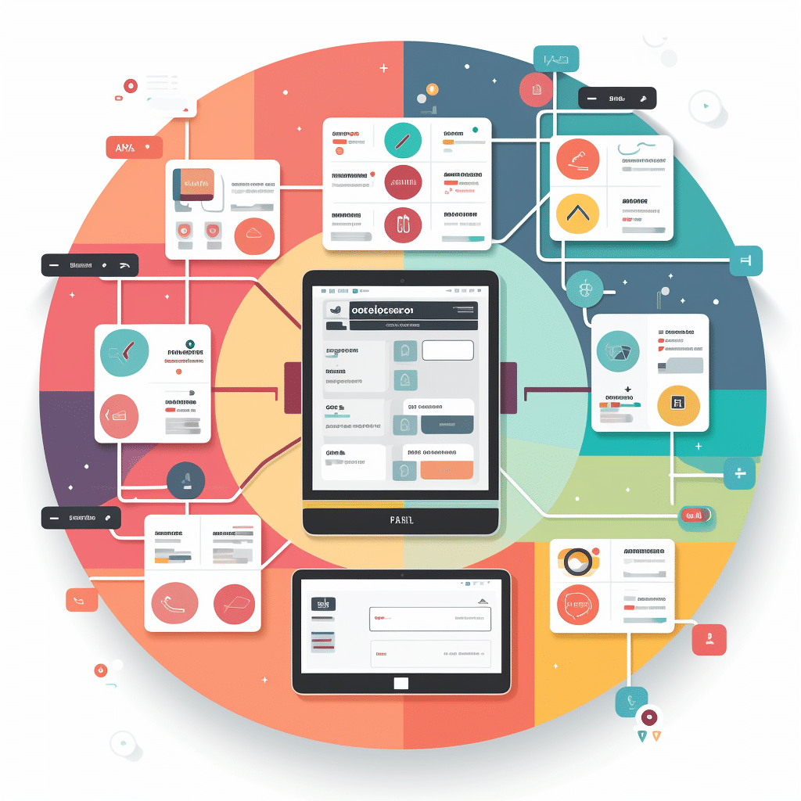

# The Power of UI Frameworks: Why Use Bootstrap 5?

UI frameworks, such as Bootstrap 5, come with their own complexities, but they offer undeniable benefits that justify the initial learning curve. If that is the case, why would someone bother with frameworks at all when you can simply use raw HTML and CSS?

This essay will explore the value of UI frameworks like Bootstrap 5, how they streamline the development process, the software engineering benefits they bring to the table, why investing the time to learn Bootstrap pays off.

## Why Not Just Use Raw HTML and CSS?

At first glance, raw HTML and CSS might seem like the best way to approach web development. They give people great control over every detail, allowing developers to make unique or complicated designs. For small projects or highly customized websites, Raw HTML and CSS works well. However, HTML and CSS quickly become complicated as complexity increases. Imagine trying to build a website from scratch, making sure it looks great on different devices ranging from phones to pc monitors. Without a framework, developers must manually handle various browser compatibility issues and other ranging issues. Every new feature or design element means diving deeper into CSS intricacies, which can slow down productivity.

## Enter UI Frameworks

UI frameworks simplify these challenges by providing pre-built components that allow developers to create layouts quickly. Instead of reinventing the wheel, developers can focus on building custom features and functionality while relying on the framework for layout and design consistency. Bootstrap 5, one of the most popular frameworks, offers a treasure trove of benefits. It includes a flexible grid system, responsive breakpoints, and a wide array of ready-to-use components like navigation bars, carousels, and buttons. With Bootstrap, creating a professional, polished website is much faster, freeing developers to focus on the unique aspects of their projects.

## Personal Experience with Bootstrap 5

Having worked with Bootstrap 5 on various projects, I’ve found that its advantages far outweigh the learning curve. Before using a framework, I struggled with ensuring consistency across various sections like headings, text blocks, and images would often look out of place or require repetitive CSS styling. When I switched to Bootstrap, the experience became much smoother. I used its grid system to organize the layout, dividing the page into rows and columns. Instead of manually adjusting widths and margins for each section, I could easily specify the column sizes and let Bootstrap handle the rest. In the end, Bootstrap 5 helped me focus on the creative aspects of my design, rather than being bogged down by messing around with layout and design consistency.

## Conclusion: Is Bootstrap 5 Worth It?

The investment of time and frustration into learning a UI framework like Bootstrap 5 is absolutely worth it. The benefits like consistency, speed, cross-browser compatibility, and responsive design make it possible to make better websites more efficiently. While frameworks do come with their own complexities and learning curve, they solve many of the problems that make web development difficult in the first place.
