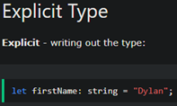

I have never used Typescript or Javascript before but after going through a tutorial and coding simple programs, it has similar implementations that I am familiar with in other languages that I know. One aspect of Typescript that caught my attention immediately was the use of explicitly writing the types for variables. 

This caught my attention because of the ability of preventing potential error and also finding problems quickly later in a code. I also like the ability to shorten functions with the use of arrow functions. 

## Athletic Software Engineering (ASE)

The ASE style of teaching with its workout of the day (WODs) is definitely a new style of learning for me compared to other classes I have taken before. WODs seem intimidating since we are timed and I am using a language I am still getting familiar with. At the moment I have the feeling of hitting the ground running but as I familiarize myself with Typescript  I am sure that WODs will become easier to handle. Although I feel a bit stressed at this moment, I feel like this will better prepare me for jobs in the future.
