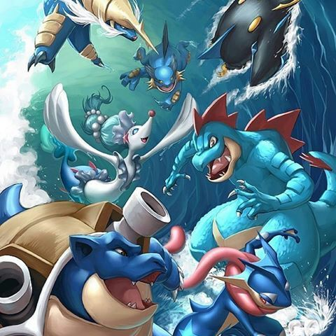

<div class="text-center p-4">
  
</div>

This was a simple project that I made to when learning class hierarchy. The pokedex program works by taking 3 classes containing "Pokemon" and assigning them nicknames. The pokedex will then relaying the information of each pokemon to the user.  

Here is part of the main code that makes new instances for the pokemon and assigns nicknames:

```
int main(int argc, char* argv[])
{
    map<string, Pokemon*> pokeMap;
    vector<string> pokeVector;
    vector<string>::iterator list;

    Pokemon *pokeball1 = new Squirtle;
    Pokemon *pokeball2 = new Blastoise;
    Pokemon *pokeball3 = new Totodile;
    pokeVector.push_back("Bubbles");
    pokeVector.push_back("Hydro");
    pokeVector.push_back("Chomper");
    pokeMap["Bubbles"] = pokeball1;
    pokeMap["Hydro"] = pokeball2;
    pokeMap["Chomper"] = pokeball3;
```
