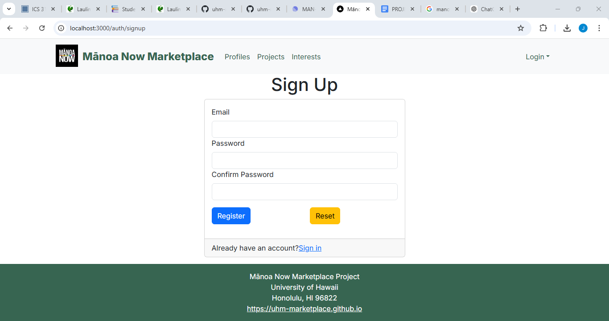

  

This was an application made by my team and I as a final project for our class ICS-314. It serves as a "marketplace" similar to Amazon and Ebay but strictly for students and staff of the UH community. I worked on connecting pages to the database. My role was to make sure the data could be stored and retrieved properly and to make the review page look clean and user-friendly.
I learned how to set up and manage database connections and how to organize the data for better performance. I also gained experience in designing web pages that work well with databases.

Here is a link to our [GitHub Organization]("https://uhm-marketplace.github.io/")
